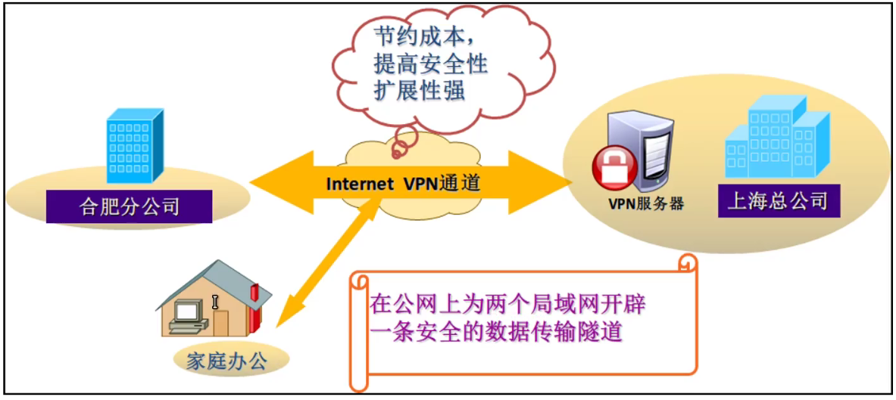

VPN产生背景：

-   在Internet传输中，绝大部分数据的内容是明文传输，存在很多安全隐患，如（窃听，篡改，冒充）

-   总部，分公司，办事处，出差人员，合作单位，需要访问总部网络资源的问题。

-   一个企业不可能把内部资源放在公网上，因为内部人员能访问得到，别人是否也能访问得到，这本身就是不安全的。

-   我们知道一个企业，他肯定是内网的，我们如何从一个内网接入到另外一个内网，这就是我们要学习的VPN的一个核心技术点，隧道。

-   在没有VPN之前，内网之间要进行互访，依靠运营商拉的专线（单独拉的线路）（价格贵，灵活性和扩展性不行）

笼统来说，网络专线就是为某个机构拉一条独立的网线，也就是一个独立的局域网，例如军事，银行等，让用户的数据传输变得可靠可信，专线的优点就是安全性好，QoS
可以得到保证。不过，专线租用价格也相对比较高，而且管理也需要专业人员。

-   

VPN：Vritual Private Network，虚拟专用网络

-   

| 术语  | 备注                                                                                                                         |
|-------|------------------------------------------------------------------------------------------------------------------------------|
| VPN   | 通过公共网络建立私有网络，并提供一定的安全性和服务质量保证。  IETF草案基于对IP的VPN定义，使用IP机制仿真出一个私有的广域网。  |
| 虚拟  | 用户不在需要拥有实际的专线，而是利用internet建立自己的私有网络                                                               |
| 专用  | 用户可以为自己定制一个最符合自己要求的网络。                                                                                 |

VPN技术核心：

-   

-   VPN有两大点：

1.  安全技术

-   密钥技术

-   身份认证

-   加解密技术

-   数据认证

1.  隧道技术

-   GRE是一种非常强大的技术，隧道技术本身不代表某一种协议，而是一种理念，隧道技术的作用就是打通私网，

如：从一个私网到另外一个私网。从IPv6跨越到IPv4在到IPv6，这些都是隧道技术范畴。

-   

-   

| 隧道技术      | 隧道两端封装，解封装，用于建立数据通道。  隧道：从一个点到另外一个点的一条路，别人看不见。                              |
|---------------|-------------------------------------------------------------------------------------------------------------------------|
| 身份认证      | 保证接入VPN的操作人员的合法性，有效性。  操作人员，使用人员的一些身份验证，用户密码，证书，指纹。                       |
| 数据认证      | 数据在网络传输过程中不被非法篡改。  数据在传输过程中如何保证没有被更改和完整性。                                        |
| 加解密技术    | 保证数据在网络中传输不被非法获取。  通过特定算法，保证数据的私密性，保证传输过程中不被非法获取，就算被获取也无法破解。  |
| 密钥管理技术  | 在不安全的网络中安全地传递密钥。                                                                                        |

-   

-   VPN其实就是隧道和安全的结合体。

-   VPN可以建立隧道，可以帮助我们通过外网访问到企业的内网，也可以从企业的内网到另外一个企业的内网，等等，只要有需求，就可以建立一个隧道，来解决需求。同时虽然这个隧道在公网上传递，但是他是安全的，就是运营商也看不到，因为这是加密的，我们可以选择高强度的加密方式保证数据的安全传输。

隧道技术图解：

-   隧道技术是如何实现内网到内网。

-   所有的隧道技术，就是在原始的数据帧封装头部，添加新的封装报头。简单的说就是我们原先的数据报头走的是公网，而我们新加的数据报头，能让我们走隧道。

-   新封装的报头，包含了源和目标IP，发送出去后，对端IP收到数据报文后会剥离隧道（GRE）的报头，然后再读取剩下的封装，完成从内网到内网之间的通讯。

-   

-   

-   比如我们右边的设备，从10.2.2.2发送到10.1.1.1，正常请求到公网就会被丢弃（公网没有私网路由），所有我们通过VPN技术先进行加密（IPsec，AH，ESP），加密后就是密文，看不到是什么类型的数据包，再加上VPN头部和新的IP头部（包含源地址和目标地址），中间所有的公网设备都通过目标IP进行查找路由转发，到达对方的设备后，在进行剥离VPN相关的报头，然后看到真正要找的目标，回包也是同样的操作。

-   

VPN的优点：

-   节约成本

-   提高安全性

-   扩展性强

-   

-   在公网上为两个局域网开辟一条安全的数据传输隧道。

VPN的类型：（根据建设单位划分）

-   

| 类型                       | 备注                                                                                      |
|----------------------------|-------------------------------------------------------------------------------------------|
| 租用运营商专线搭建VPN网络  | MPLS VPN  核心点在于，运营商会学习和接收企业的私网路由，然后再运营商的骨干网里进行传输。  |
| 用户自建企业VPN网络        | GRE，PPTP，L2TP , IPsec，SSLVPN                                                           |

-   运营商MPLSVPN。

-   

-   用户自建VPN，更适合企业的需求，灵活的部署。

-   

VPN的类型：（根据组网方式）

-   

| 类型                             | 备注                                                                                                                                               |
|----------------------------------|----------------------------------------------------------------------------------------------------------------------------------------------------|
| Remote-Access VPN  远程访问VPN   | 适合出差员工，移动办公等VPN拨号接入的场景。  员工可以在任何能够接入公网的地方，通过远程拨号接入企业内网，从而访问内网资源。  通常拨号方IP不固定。  |
| Site-to-Site VPN  站点到站点VPN  | 适合各分支机构，合作伙伴，客户，供应商间的互联。  双方都有固定的IP。建立好后，不用进行拨号，可以直接进行访问。                                     |

Remote Access VPN

-   

-   出差员工通过公网连接到公司的VPN出口服务，进行拨号远程接入即可。

-   有可能VPN服务在内网内，这时需要通过NAT服务器进行映射就行。这样子就可以通过VPN访问内网资源了。

-   

Site to site

-   

-   服务都在出口设备固定搭建好了，企业员工可以直接进行访问。不需要进行拨号，两个服务类型的VPN可以同时存在，这并不矛盾。

-   而且会在出口做好策略，哪些流量加密走VPN，哪些不走（上网用途）。

-   

-   以上两种形式的VPN我们都可能会用到，包括像SSLVPN，也属于远程接入VPN。

-   Site to site 一般也叫L2L（lan to lan）局域网到局域网。

-   适合场景不一样，但是需求和功能是一样的。

-   

VPN类型：（根据实现层次，协议划分）

-   按协议划分VPN类型，具体VPN实现的技术就这些。

-   分为二层VPN（PPTP，L2P，L2TP），三层VPN（IPsec，GRE）和七层VPN（SSLVPN）。

-   追求最安全的最好使用L7层VPN，SSLVPN。

-   L2VPN使用的都是PPPOE加上以太网的封装来实现的，所以和拨号也是有关系的，所以在二层里面很多都离不开PPP这个协议。

-   PPTP是微软搞出来的，所以对其他的一些厂商兼容性不太行，因此思科又搞了一个L2F（F代表转发）出来的，L2TP是微软和思路技术的结合。

-   

-   

-   其实GRE没有任何的安全性，他不进行保护，他只是告诉你应用的范围，只有IPsec和SSLVPN才会有真正的加密，如果要加密和安全，只有IPsec和SSLVPN。

-   L2TP没有加密技术也没有认证技术，但是能使用IPsec加入进来，也就是说他们是可以联动的。

-   IPsec可以单独使用，也可以用它来保护GRE和L2TP。本身GRE和L2TP是缺乏安全技术的，但是可以通过IPsec来解决这个问题。

-   GRE是最强的隧道技术，但是他没有安全性，所以一般不会单独使用他。一般会使用IPsec来保护，或者单独使用IPsec。GRE用于IPv6跨越IPv4在到IPv6，这种时候会用到GRE。

-   SSLVPN是应用层，所以他直接对应用层数据进行保护，认证方法较多，

-   L2TP的端口类型是UDP 1701。PPTP的端口类型是TCP 1723。
