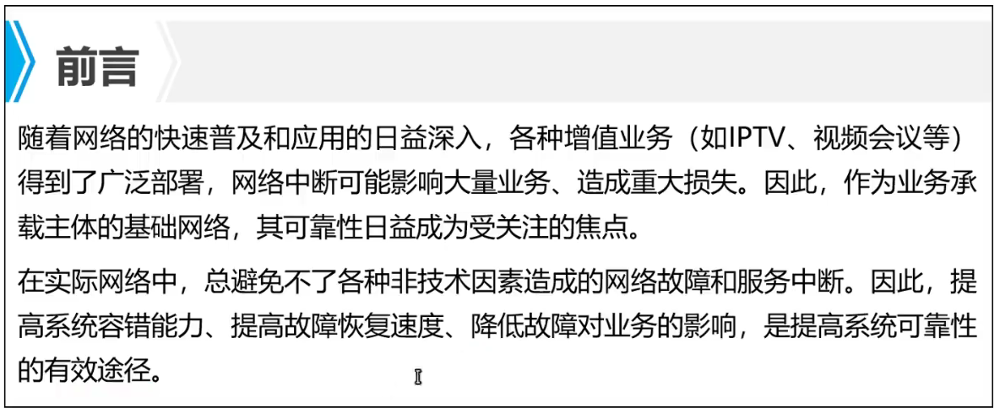
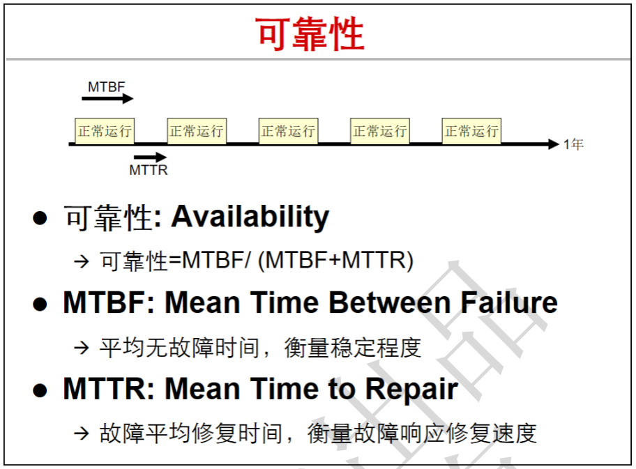
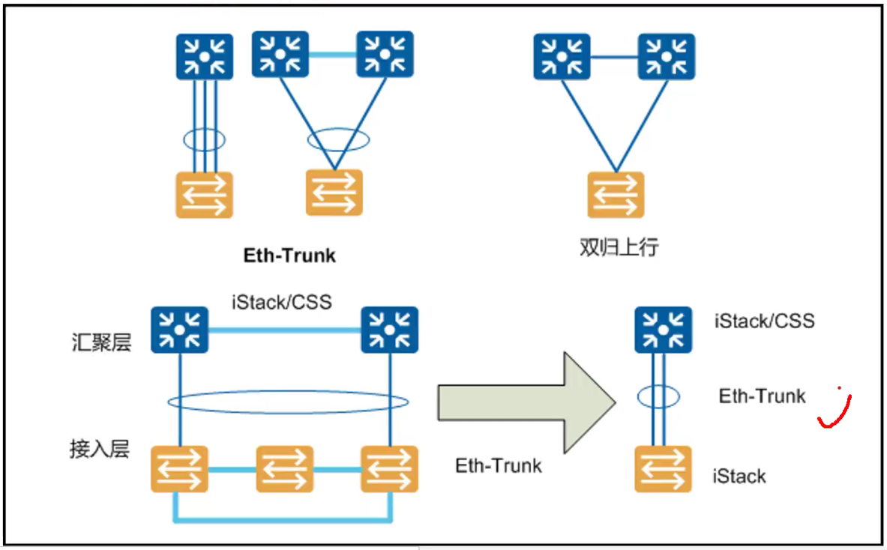
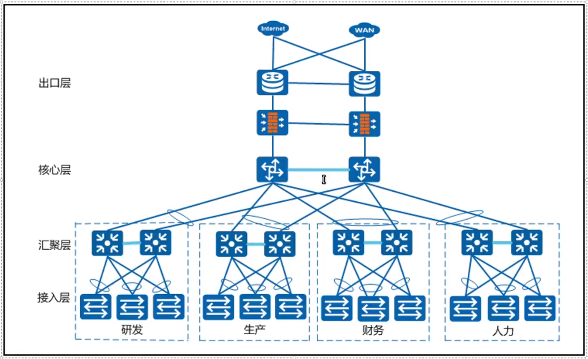
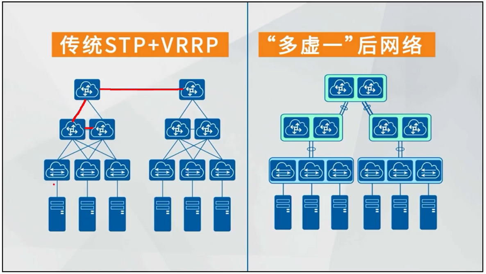

-   

-   随着网络的快速普及和发展，各种增值业务得到广泛的部署，如果网络中断会影响大量的业务，造成重大损失。因此，作为企业业务承载主体的基础网络，其可靠性日益成为受关注的焦点。

-   在实际网络中，总避免不了各种非技术因素造成的网络故障和服务中断，因此提高系统的容错（冗余）能力，提高故障恢复速度，降低故障对业务造成的影响，是提高系统可靠性的有效途径。

可靠性需求：根据目标和实现方法的不同，可以分为三个级别

-   

| 级别  | 目标                                              | 实现方法                                                                                |
|-------|---------------------------------------------------|-----------------------------------------------------------------------------------------|
| 1     | 减少系统的软，硬件故障                            | 软件：软件可靠性设计，可靠性测试等  硬件：简化电路设计，提高生产工艺，进行可靠性试验等  |
| 2     | 即使系统发生故障，也能不受影响                    | 设备和链路采用冗余设计，部署倒换策略，提高倒换成功率                                    |
| 3     | 尽管发生故障，导致功能受损，  但系统也能快速恢复  | 提高故障检测，诊断，回复和隔离技术                                                      |

可靠性度量：

-   MTBF:平均无故障时间，越大越好，证明系统越稳定

-   MTTR:故障平均修复时间，越小越好，证明系统响应故障速度快。

-   

HA：High Avaliability，高可靠性

-   指一个产品或者系统有很高的可靠性，是一整套综合技术，主要包含冗余容错，链路保证，节点故障修复和流量工程。

-   不能频繁出现故障。

-   出现故障后很块恢复。

网络可靠性设计主要包括两个方面：

-   设备可靠性：要求多设备能够堆叠组网，要求单设备具有电信级可靠性99.999%，支持双电源，双风扇等。

-   链路可靠性：体现在链路设计和组网形态上，通常采用多上行链路，包括ETH-trunk/LAG技术，双归上行。

-   

-   

-   
